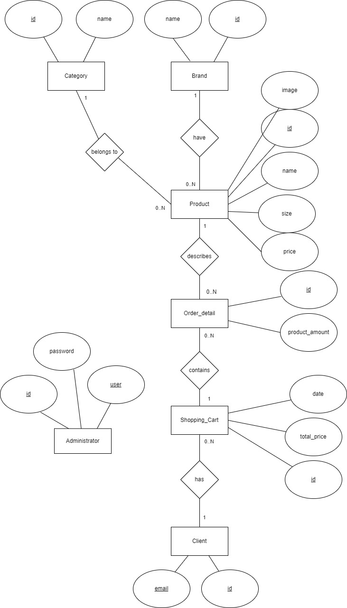
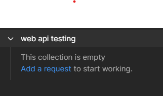
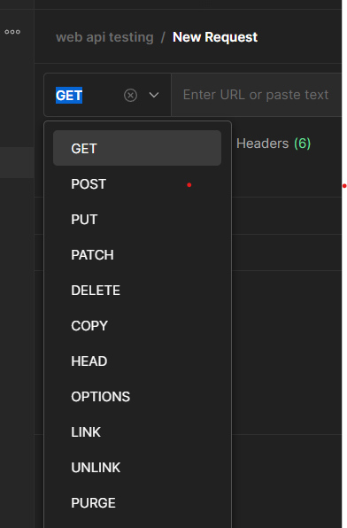
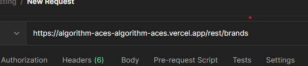
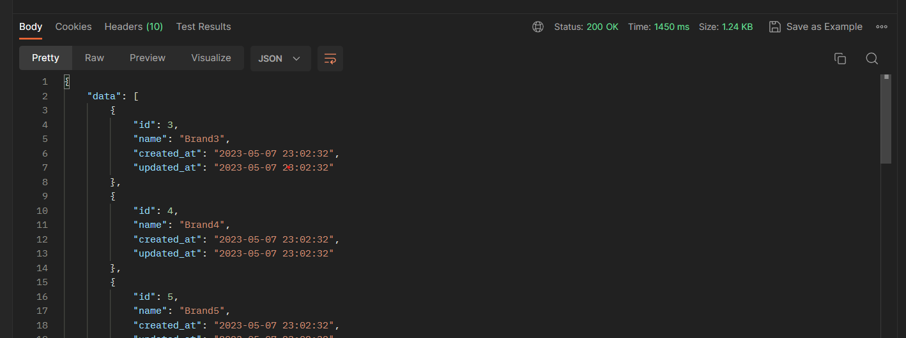
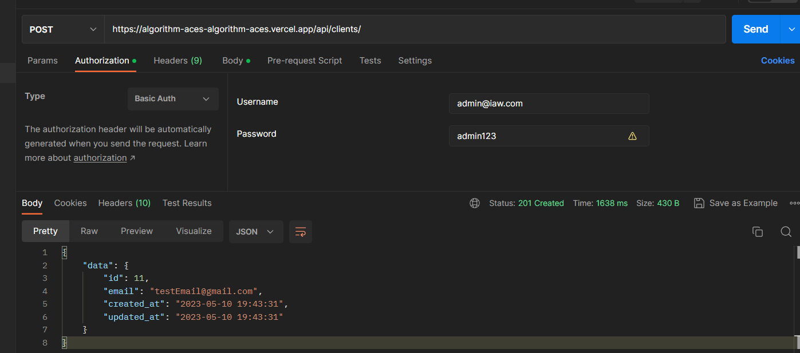
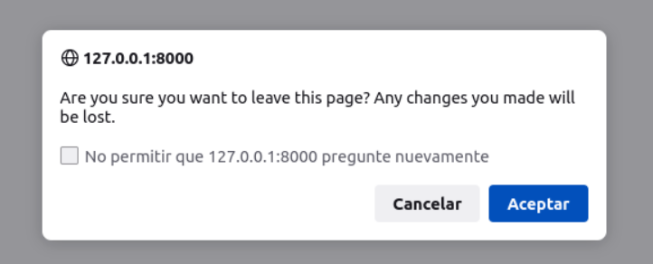
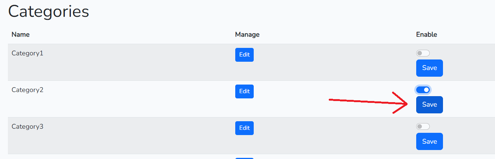

# LA GLORIA STORE


## Links de interés
- [Página oficial](https://la-gloria-store-algorithm-aces.vercel.app/)
- [Prueba nuestra API! (Swagger UI)](https://la-gloria-store-algorithm-aces.vercel.app/rest/documentation/)

## Idea a Implementar

El proyecto se trata de una tienda virtual orientada a ropa y calzado deportivo en el que el cliente puede recorrer la tienda viendo los productos disponibles añadirlos a su carrito de compras, el cuál puede modificar y eventualmente confirmar, haciendo efectiva su compra.

## Diagrama ER




Como característica a notar en el diagrama, se puede ver que el carrito de compras registra un valor 'total_price' que representa el precio total del carrito al momento de confirmarlo. Cuando se guarda en la base de datos, esta entidad será inmutable.

Esto se decidió de esta manera, en oposición a la idea de dejar el precio total del carrito de manera computable dinámicamente a partir de los productos a los que está asociado, ya que si a un producto se le actualiza el precio, se verá afectado retroactivamente el precio de un carrito ya confirmado en el pasado, y no se quiere eso.

## Actualizaciones e información de los datos

Desde la vista de administrador, se permitirá que este pueda crear, modificar y eliminar cada registro para las entidades de categorías, marcas, productos, detalles de orden y carritos de compra.
Los reportes que se podrán visualizar en la aplicación Laravel serán respectivos para cada tipo de usuario (El administrador tendrá su propia vista en la que puede hacer alta, baja y modificación de cada entidad y también verá las que están presentes en la base de datos).
A través de la API de la aplicación Laravel se podrá obtener información de cada producto, categoría, marca, detalle de orden y carrito de compra.
A través de la API de la aplicación Laravel se podrá crear el registro de un carrito de compra y sus detalles de orden asociados (ya que los usuarios finales harán compras y se deberá persistir esta información en la base de datos).


## Cómo probar nuestro servicio Web
Ten en cuenta que nuestros recursos se deben acceder con el prefijo /rest/ 

Por ejemplo:
```
    https://algorithm-aces-algorithm-aces.vercel.app/rest/brands/
```

### Postman 
- Descargar e instalar Postman: Lo primero que debes hacer es descargar e instalar Postman en tu ordenador. Postman es una herramienta gratuita que te permite enviar peticiones HTTP a una API y ver las respuestas que devuelve.
En el [siguiente link](https://www.postman.com/downloads/) podrás acceder su portal de descargas.
- Configurar la petición: Puedes crear una nueva petición haciendo clic en el botón "New" en la esquina superior izquierda de la pantalla. En la ventana que se abre, selecciona el tipo de petición que quieres enviar (GET, POST, PUT, DELETE, etc.), ingresa la URL de la API que deseas y agrega los parámetros necesarios en la pestaña "Params" o en el cuerpo de la petición.
- 
- 
- 
- Enviar la petición: Una vez que la petición está configurada, haz clic en el botón "Send" para enviarla a la API. Postman mostrará la respuesta que devuelve la API en la pestaña "Body", junto con el código de estado y otros detalles de la respuesta.
- 
- Es posible que para ciertas solicitudes de tipo POST, necesites tener previamente credenciales de usuario válido del servidor. Para configurar estos datos en postman, revisa la sección Authorization y selecciona el tipo Basic Auth. Luego, rellena las credenciales con las de un usuario válido.
- 
- Inspeccionar la respuesta: Si quieres inspeccionar más detalles de la respuesta, puedes cambiar a las pestañas "Headers", "Cookies" o "Tests". La pestaña "Headers" muestra los encabezados de la respuesta, la pestaña "Cookies" muestra las cookies que se establecen en la respuesta y la pestaña "Tests" te permite escribir pruebas automatizadas para verificar la respuesta.
- Guardar la petición: Si quieres guardar la petición para usarla más tarde, puedes hacer clic en el botón "Save" en la esquina superior derecha de la pantalla (O usa Crtl + S). Postman te permitirá guardar la petición en una colección existente o en una nueva colección.

### Windows PowerShell
- Abrir PowerShell: puedes abrir PowerShell presionando Windows + X y luego eligiendo Windows PowerShell de la lista.

- Enviar una solicitud al endpoint de la API: el cmdlet Invoke-RestMethod se utiliza en PowerShell para enviar solicitudes HTTP a un servicio web RESTful o un endpoint de API. Aquí tienes un ejemplo de cómo usarlo para enviar una solicitud GET a un endpoint de API:

    ```
    $response = Invoke-RestMethod -Uri 'http://api.example.com/data' -Method Get
    ```
    Puedes utilizar la variable $response para trabajar con la respuesta del servidor.

- Si necesitas enviar una solicitud POST, puedes hacerlo cambiando el parámetro -Method a Post e incluyendo los datos que deseas enviar con el parámetro -Body

    Primero, declara la variable $body con los datos que deseas enviar:

    ```
    $body = @{
        "email" = "clientTestEmail@gmail.com"
    }
    ```
    También necesitarás ingresar las credenciales de autenticación. Puedes hacerlo con los siguientes comandos:

    ```
    $username = "tu-usuario"
    $password = "tu-contraseña"
    $secpasswd = ConvertTo-SecureString $password -AsPlainText -Force
    $cred = New-Object System.Management.Automation.PSCredential ($username, $secpasswd)

    $headers = @{ "Content-Type" = "application/json" }
    ```
    Then, use the variables in the next command
    ```
    $response = Invoke-RestMethod -Uri http://localhost:8000/api/clients -Method Post -Credential $cred -Headers $headers -Body $body
    ```
    Luego, utiliza las variables en el siguiente comando:

    ```
    $response = Invoke-RestMethod -Uri http://localhost:8000/api/clients -Method Post -Credential $cred -Headers $headers -Body $body
    ```

### Para usuarios de Linux: usando la Terminal (Ubuntu)
- Abrir la Terminal: puedes abrir la terminal presionando Ctrl + Alt + T en tu teclado.

- Enviar una solicitud al endpoint de la API: en Linux, usamos el comando curl para enviar solicitudes HTTP a un endpoint de la API. Aquí hay un ejemplo de cómo enviar una solicitud GET a un endpoint de la API:
    ```
    curl https://api.example.com/data
    ```
    La respuesta del servidor se imprimirá directamente en la terminal.

- Si deseas enviar una solicitud POST, puedes hacerlo usando la opción -X para especificar el método de solicitud y la opción -d para incluir los datos:

    ```
    curl -X POST -d "key1=value1&key2=value2" https://api.example.com/data
    ```
    Puedes usar la opción -o seguida de un nombre de archivo para guardar la respuesta en un archivo:

    ```
    curl -o response.txt https://api.example.com/data
    ```

## Visualización y Acceso a la Información

El usuario final (que en principio no tendrá login, pero se identificará con su email) podrá visualizar la totalidad de productos de la tienda y se podrá hacer búsquedas específicas utilizando filtros, por ejemplo, por marca, categoría, nombre, precio, etc.

Entre las acciones posibles, se incluye la posibilidad de realizar compras de productos, utilizando un carrito de compras que se puede modificar de manera libre, agregando y  eliminando del carrito los productos deseados previamente a la confirmación de su compra.

En su primera sesión, se solicitará su email para su vinculación a sus carritos al momento de confirmar una compra con un carrito y en futuras sesiones se usará para ver los datos de sus propios carritos de compra hechos, como la fecha de su compra, cantidad de productos asociados y precio total del pedido.


# Aclaraciones y Problemas conocidos:
- En Mozilla firefox, si le das *don't show again* en el cuadro de dialogo al editar entidades, luego estos botones pueden no funcionar debido al funcionamiento.

Este problema está relacionado al manejo de cookies del navegador y para solucionarlo, se debe eliminar la preferencia de no permitir más cuadros de diálogo en el sitio.

- En la versión actual, al actualizar el estado activado/desactivado de las entidades Marca, Categoría y Producto, se recomienda actualizar uno a la vez ya que los botones de guardado solo tienen en cuenta a su fila correspondiente.

En la imagen, guardar con el botón señalado hará que se actualice correspondientemente la Categoría 2, y las demás no se verán alteradas aunque se haya cambiado su estado temporalmente.

- Los datos de prueba actualmente son de práctica, pero son totalmente funcionales en cuanto a las funcionalidades que el sistema puede proveer. Si se desea, se puede configurar un conjunto de datos de prueba verosímil y similares a través de un seeding.

# Minutas - Decisiones tomadas:
- Notar que se puede insertar un numero entero en el campo de stock. Si es positivo, se sumará, si es negativo, se restará, y se llegará hasta 0 o hasta 9999. Se hizo de esta forma ya que un botón para establecer el número podría generar casos inconsistentes (si un usuario comprara items que redujeran el stock en la ventana de tiempo entre que el admin edita el stock, podría resultar en información perdida ya que lo setea).

- Baja lógica: Ya que no vamos a tener eliminaciones en la base de datos del lado del admin, se requiere una manera de inhabilitar las entidades de manera lógica para no generar eliminaciones en cascada y generar pérdida de la información. Resolvimos esto con una variable booleana enable en los modelos.

<br>
<br>
<br>

# LA GLORIA STORE


- [Official Page](https://la-gloria-store-algorithm-aces.vercel.app/)
- [Try our API! (Swagger UI)](https://la-gloria-store-algorithm-aces.vercel.app/rest/documentation/)


## Idea to Implement

The project is about a virtual store focused on sportswear and footwear, in which the customer can browse the store, view the available products, add them to their shopping cart, which they can modify and eventually confirm, making their purchase effective.

## ER Diagram


As a noteworthy feature in the diagram, it can be seen that the shopping cart records a 'total_price' value which represents the total price of the cart at the moment of confirmation. When saved in the database, this entity will be immutable.

This decision was made in contrast to the idea of leaving the total price of the cart computable dynamically based on the products it is associated with, as if a product's price is updated, it will retroactively affect the price of a cart already confirmed in the past, and that is not desired.

## Data Updates and Information

From the administrator's view, it will be allowed to create, modify, and delete each record for the entities of categories, brands, products, orders details, and shopping carts. The reports that can be viewed in the Laravel application will be respective for each type of user (The administrator will have their own view where they can create, delete, and modify each entity and also see the ones present in the database).

Through the Laravel application API, information can be obtained for each product, category, brand, order detail, and shopping cart. Through the Laravel application API, it will be possible to create a record for a shopping cart and its associated order details (since end-users will make purchases and this information needs to be persisted in the database).

## How to test our Web Service
Please note that our resources must be accessed with the prefix /rest/.

For example:
```
    https://algorithm-aces-algorithm-aces.vercel.app/rest/brands/
```


### Postman
- Download and install Postman: The first thing you need to do is download and install Postman on your computer. Postman is a free tool that allows you to send HTTP requests to an API and see the responses it returns. In the [following link](https://www.postman.com/downloads/), you can access their download portal.

- Configure the request: You can create a new request by clicking the "New" button in the top left corner of the screen. In the window that opens, select the type of request you want to send (GET, POST, PUT, DELETE, etc.), enter the URL of the API you want, and add the necessary parameters in the "Params" tab or in the body of the request.
- 
- 
- 
- Send the request: Once the request is configured, click the "Send" button to send it to the API. Postman will show the response that the API returns in the "Body" tab, along with the status code and other details of the response.
- 
- For certain POST requests, you may need to have valid user credentials from the server beforehand. To configure this data in Postman, review the Authorization section and select the Basic Auth type. Then, fill in the credentials with those of a valid user.
- 
- Inspect the response: If you want to inspect more details of the response, you can switch to the "Headers", "Cookies" or "Tests" tabs. The "Headers" tab shows the headers of the response, the "Cookies" tab shows the cookies that are set in the response, and the "Tests" tab allows you to write automated tests to verify the response.
- Save the request: If you want to save the request for later use, you can click the "Save" button in the top right corner of the screen (Or use Crtl + S). Postman will allow you to save the request in an existing collection or in a new collection.

### Windows PowerShell
- Open PowerShell: you can open PowerShell by pressing Windows + X and then choosing Windows PowerShell from the list.
- Send a Request to the API Endpoint: the Invoke-RestMethod cmdlet is used in PowerShell to send HTTP requests to a RESTful web service or an API endpoint. Here is an example of how to use it to send a GET request to an API endpoint:

    ```
    $response = Invoke-RestMethod -Uri 'http://api.example.com/data' -Method Get
    ```

    You can use the $response variable to work with the response from the server.

- If you need to send a POST request, you can do so by changing the -Method parameter to Post and including the data you wish to send with the -Body parameter

    First, declare the $body variable with the data you want

    ```
    $body = @{
        "email" = "clientTestEmail@gmail.com"
    }
    ```
    You will need to fill auth credentials too. You can do it with the next commands:

    ```
    $username = "your-username"
    $password = "your-password"
    $secpasswd = ConvertTo-SecureString $password -AsPlainText -Force
    $cred = New-Object System.Management.Automation.PSCredential ($username, $secpasswd)

    $headers = @{ "Content-Type" = "application/json" }
    ```
    Then, use the variables in the next command
    ```
    $response = Invoke-RestMethod -Uri http://localhost:8000/api/clients -Method Post -Credential $cred -Headers $headers -Body $body
    ```
### For Linux Users: Using Terminal (Ubuntu)
- Open Terminal: you can open the terminal by pressing Ctrl + Alt + T on your keyboard.
- Send a Request to the API Endpoint: we use the curl command in Linux to send HTTP requests to an API endpoint.
Here's an example of how to send a GET request to an API endpoint:
    ```
    curl https://api.example.com/data
    ```
    The response from the server will be printed directly to the terminal.

- If you want to send a POST request, you can do so by using the -X option to specify the request method and the -d option to include the data:

    ```
    curl -X POST -d "key1=value1&key2=value2" https://api.example.com/data
    ```
    You can use the -o option followed by a filename to save the response to a file:

    ```
    curl -o response.txt https://api.example.com/data
    ```

## Information Visualization and Access

The end-user (who initially won't have a login but will identify themselves with their email) will be able to view all the products in the store, and specific searches can be made using filters, for example, by brand, category, name, price, etc.

Among the possible actions, the possibility of making purchases of products is included, using a shopping cart that can be freely modified by adding and removing desired products before confirming the purchase.

In their first session, their email will be requested for linking to their carts at the time of confirming a purchase with a cart, and in future sessions, it will be used to view the data of their own made shopping carts, such as the date of their purchase, the quantity of associated products, and the total price of the order.

## Clarifications and Known Issues:
- In Mozilla Firefox, if you click "don't show again" in the dialog box when editing entities, then these buttons may not function properly due to cookie handling.

This issue is related to the browser's cookie handling and to resolve it, the preference to disallow further dialog boxes on the site must be removed.

- In the current version, when updating the active/inactive state of the Brand, Category, and Product entities, it is recommended to update one at a time since the save buttons only take into account their corresponding row.

In the image, saving with the highlighted button will update Category 2 accordingly, and the others will not be affected even though their state has been temporarily changed.

- The test data currently in place is for practice purposes, but is fully functional in terms of the system's provided functionalities. If desired, a plausible and similar set of test data can be configured through seeding.

# Decisions Made:
- Note that an integer can be inserted into the stock field. If it is positive, it will be added, if it is negative, it will be subtracted, and it will reach 0 or 9999. This was done this way because a button to set the number could generate inconsistent cases (if a user bought items that reduced the stock in the time window between when the admin edits the stock, it could result in lost information as it sets it).

- Logical Deletion: Since we will not have deletions in the database on the admin side, a way to disable entities logically is required to avoid generating cascading deletions and generating information loss. We solved this with a boolean variable "enable" in the models.